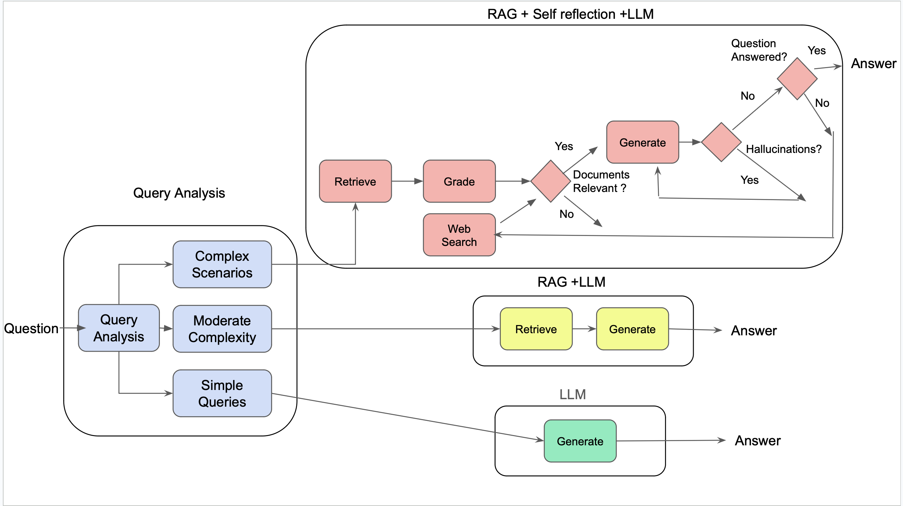

# Code of Law AI - Updated Version

🏛️ **Adaptive RAG System for Legal Queries**

An intelligent legal advisor that dynamically routes queries based on complexity and provides AI-powered answers with built-in safeguards against hallucination.

## 🚀 What's New in v2.0

- ✅ **Updated to Latest LangChain** (v0.3+)
- ✅ **Modern LangGraph Integration** 
- ✅ **Improved Error Handling**
- ✅ **Interactive Streamlit Chatbot**
- ✅ **Automatic Vector Store Creation**
- ✅ **Enhanced Complexity Routing**
- ✅ **Self-Reflection & Quality Checking**

## 🏗️ Architecture



### Three-Tier Processing System

1. **🟢 Simple Queries** → Direct LLM processing
   - Basic definitions, off-topic questions
   - Fast response, no document retrieval

2. **🟡 Moderate Queries** → RAG with vector store
   - Standard legal questions
   - Document retrieval + LLM generation

3. **🔴 Complex Queries** → Self-reflection flow
   - Multi-faceted legal issues
   - Document grading, hallucination checking, iterative refinement

### Components

- **Query Router**: Classifies question complexity
- **Document Grader**: Scores relevance of retrieved documents  
- **Hallucination Grader**: Checks if answers are grounded in facts
- **Answer Grader**: Verifies responses address the question
- **Query Rewriter**: Optimizes questions for better retrieval

## 📋 Prerequisites

- Python 3.8+
- OpenAI API key
- (Optional) Tavily API key for web search

## 🛠️ Setup Instructions

### 1. Clone and Setup Environment

```bash
cd Code-of-Law-Ai
python3 -m venv venv
source venv/bin/activate  # On Windows: venv\Scripts\activate
pip install -r requirements_streamlit.txt
```

### 2. Configure Environment Variables

```bash
# Copy the example environment file
cp .env.example .env

# Edit .env with your API keys
OPENAI_API_KEY=your_openai_api_key_here
TAVILY_API_KEY=your_tavily_api_key_here  # Optional
```

### 3. Initialize Vector Store

The system will automatically create a FAISS vector store from legal web sources on first run. Alternatively, run the vector store creation manually:

```bash
python3 vector_store.py
```

## 🏃‍♂️ Usage

### Streamlit Chatbot (Recommended)

```bash
# Run the interactive chatbot
./run_streamlit.sh
# Or: streamlit run streamlit_app.py
```

Then visit: **http://localhost:8501**

### Command Line Testing

```bash
# Test the system with sample queries
python3 test_system.py
```

### Web API

```bash
# Start the Flask API server
python3 updated_api.py
```

Then visit:
- **Web Interface**: http://localhost:5000/
- **API Status**: http://localhost:5000/api/status
- **Example Questions**: http://localhost:5000/api/examples

### Python Integration

```python
from updated_pipeline import process_query

# Process a legal question
result = process_query("What are my tenant rights in NYC?")
print(result["answer"])
```

## 📊 Example Queries

### Simple (Direct LLM)
- "What is a lease?"
- "What does eviction mean?"
- "Define security deposit"

### Moderate (RAG)
- "How do I file a complaint against my landlord?"
- "What are my rights as a tenant in New York?"
- "How much notice does a landlord need to give?"

### Complex (Self-Reflection)
- "What are the legal implications of breaking a lease due to habitability issues?"
- "Can my landlord evict me for having a pet if it's not in my lease?"
- "What recourse do I have if my apartment was damaged in a fire?"

## 🚀 Deployment

### Railway (Recommended)
Follow the `RAILWAY_DEPLOY.md` guide for one-click deployment with custom domain.

### Streamlit Cloud (Free)
Deploy directly from GitHub to Streamlit Cloud for free hosting.

### Docker
Use the provided `Dockerfile.streamlit` for containerized deployment.

## 🔧 Technical Details

### Tech Stack
- **LangChain 0.3+** - RAG pipeline orchestration
- **LangGraph** - Workflow management
- **FAISS** - Vector similarity search
- **OpenAI GPT-4o** - Language model
- **Streamlit** - Interactive web interface
- **Flask** - API backend
- **Pydantic** - Data validation

### Data Sources
Legal documents from:
- NY Attorney General tenant rights guide
- NYC landlord-tenant law resources
- Legal Services NYC housing info
- NY housing & community renewal
- Consumer finance disaster recovery

### Performance
- **Simple queries**: ~1-2 seconds
- **Moderate queries**: ~3-5 seconds  
- **Complex queries**: ~5-10 seconds (with quality checking)

## 🛡️ Safety Features

- **Hallucination Detection**: Checks if answers are grounded in source documents
- **Relevance Scoring**: Filters irrelevant retrieved documents
- **Answer Validation**: Ensures responses address the original question
- **Query Transformation**: Rewrites unclear questions for better retrieval
- **Legal Disclaimers**: Includes appropriate disclaimers in responses

## 📁 File Structure

```
Code-of-Law-Ai/
├── streamlit_app.py           # Interactive Streamlit chatbot
├── updated_pipeline.py        # Main RAG pipeline
├── updated_api.py            # Flask web API
├── test_system.py            # Testing script
├── requirements_streamlit.txt # Streamlit dependencies
├── .env.example              # Environment template
├── DEPLOYMENT_GUIDE.md       # Comprehensive deployment guide
├── RAILWAY_DEPLOY.md         # Quick Railway deployment
└── faiss_index/              # Generated vector store
    ├── index.faiss
    └── index.pkl
```

## 🐛 Troubleshooting

### Common Issues

1. **"No module named 'streamlit'"**
   ```bash
   pip install -r requirements_streamlit.txt
   ```

2. **"OPENAI_API_KEY not set"**
   - Create `.env` file with your API key
   - Ensure file is in the project root directory

3. **"Could not load FAISS index"**
   - System will auto-create on first run
   - Or manually run: `python3 vector_store.py`

4. **API connection errors**
   - Check your OpenAI API key is valid
   - Ensure you have sufficient API credits

### Debug Mode

Enable detailed logging:
```python
result = process_query("your question", debug=True)
```

## 🔮 Future Enhancements

- [ ] Support for more legal jurisdictions
- [ ] Integration with legal databases
- [ ] Multi-language support
- [ ] Advanced citation tracking
- [ ] Integration with case law databases
- [ ] Voice interface support

## 📄 License

This project is for educational and research purposes. Please ensure compliance with applicable laws and API terms of service.

---

**⚖️ Legal Disclaimer**: This system provides general legal information and should not be considered as legal advice. Always consult with qualified legal professionals for specific legal matters.

